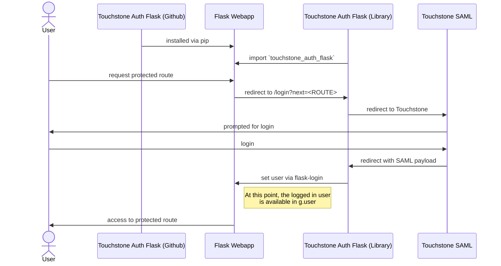

# touchstone-auth-flask

This repository provides a Flask blueprint and some related utilities, as an installable 
python library to provide Touchstone SAML authentication for a Flask app.

By default, when the provided Flask blueprint `touchstone_auth_flask` is imported and registered,
it will provide a number of routes with the prefix `/auth` that support login and 
authentication. See the [example Flask app in this repository for an annotated example](touchstone_auth_flask/app.py).

The following is a very high level sequence diagram of authentication for a Flask app that installs 
and utilizes this library:



The purpose of this library is to remove the burden of wiring up Touchstone SAML authentication
for a new Flask webapp.  Because the Flask webapp will itself be a SAML "Service Provider (SP)",
it will still require registration with IS&T and some environment variables.  But this library
removes the need to wire up the actual SAML routes, handshakes, and session login via Flask.

## Development

### Installation

1. Clone the repository
2. Run `make install` to create a pipenv virtual environment
3. Set required and optional environment variables (see below) in `.env` file

### `touchstone-auth-flask` library

The installable library is comprised of all files and modules under the folder 
`touchstone_auth_flask/lib`.  Only files and folders under this directory will be available
to the Flask app that installs and uses this library.  This is governed by the file 
`setup.py` in the root of this project repository, which also sets dependencies the installing
context should include.

When changes are made to this library it is **highly recommended** to bump the semantic 
version number in `setup.py` to ensure that applications that install and use this library
will get a new version.

### Local IdP server

This library comes with a convenience function to run an instance of [SimpleSAMLphp](https://simplesamlphp.org/)
via Docker as a local IdP for testing.

A user exists with username / password: `user1` / `password`.

This testing SAML IdP server can be invoked via the command line:
```shell
pipenv run simple_saml_server
```

Or directly from python (helpful for integration testing):
```python
from touchstone_auth_flask.lib.utils.simple_saml_server import run_simple_saml_server
run_simple_saml_server()
```


## Usage in Flask App

This library can be installed via pipenv:

```shell
pipenv install git+https://github.com/MITLibraries/touchstone-auth-flask.git
```

This will create an entry in the `Pipfile` that looks similar to:
```
touchstone-auth-flask = {git = "git+https://github.com/MITLibraries/touchstone-auth-flask.git"}
```

## Environment Variables

### Required

```shell
# General
FLASK_ENV=development # drives Config classes used in touchstone_auth_flask.lib.config
SECRET_KEY=# required by python3-saml and flask-login; default value provided in development and testing contexts
AUTH_DEFAULT_VIEW=# default Flask route during logout or login with next URL; e.g. "index" or "my_blueprint.foo" 

# SAML Service provider
SP_ENTITY_ID=# primary login URL for this SP, likely ending with /auth/saml/login
SP_ACS_URL=# primary handshake URL for this SP, likely ending with /auth/saml/acs
SP_CERT=# this SP certificate; optional for local development where it will get set automatically 
SP_KEY=# this SP key; optional for local development where it will get set automatically

# SAML Identity provider
IDP_ENTITY_ID=# IdP (Touchstone) login endpoint
URN_UID=# dictionary key in the parsed IdP SAML response for the authenticated user's unique identifier
```

### Optional / Development

```shell
# SAML Identity provider
IDP_CERT=# IdP (Touchstone) certificate; if set will override that retrieved from IdP metadata
IDP_SSO_URL=# IdP (Touchstone) SSO endpoint; if set will override that retrieved from IdP metadata
```

